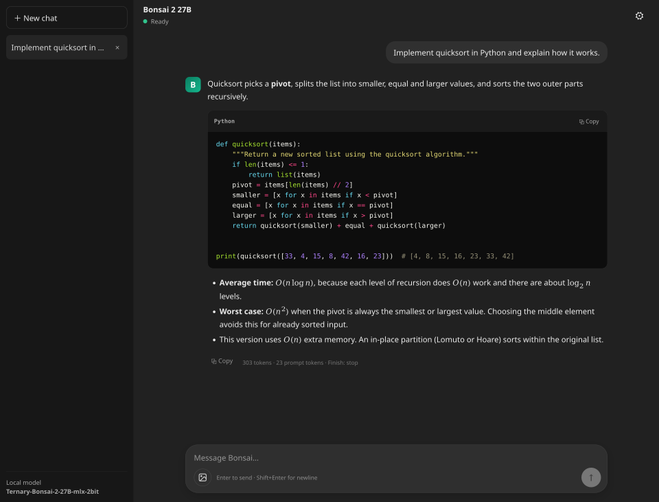

# Bonsai Chat

Bonsai Chat is a local Flask chat UI for
`prism-ml/Ternary-Bonsai-2-27B-mlx-2bit`, using the model's bundled
`vision_artifact.load_vl_model` loader and `mlx_vlm.stream_generate`.
The app does not replace that loader with a generic model loader. It supports
text and image input, sampling/repetition controls, and an automatic loop guard.



*The interface in use (vector image, so it stays sharp when zoomed). This capture
comes from the real app in Firefox, but the
reply text is a sample answer streamed through the app with the model's forward
pass stubbed out: the CPU-only machine it was taken on cannot run the model at a
usable speed. Rendering, highlighting, math and the token counts (computed with
the model's tokenizer) are genuine; the wording is not model output.*

## Install and run

```bash
cd bonsai-chat
./install.sh
./run.sh
```

`install.sh` is safe to re-run. It:

1. creates `.venv` (Python 3.10 or newer) and installs `requirements.txt`;
2. downloads the model pack (about 8.6 GB) from Hugging Face into its own
   folder inside a shared models directory:
   `~/models/Ternary-Bonsai-2-27B-mlx-2bit`;
3. verifies every file against the SHA-256 manifest (`files.json`) shipped in
   the pack;
4. installs the pack's pinned `runtime/requirements.txt` into `.venv`.

The model is no longer expected inside a project directory. An interrupted
download can be resumed by running `./install.sh` again; complete files are
skipped.

| Option | Effect |
|---|---|
| `--models-dir DIR` | Use `DIR` instead of `~/models`. The pack still gets its own `Ternary-Bonsai-2-27B-mlx-2bit` folder inside it. `BONSAI_MODELS_DIR` sets the same default. |
| `--move-from DIR` | Move an already downloaded pack into the models directory instead of downloading it again. |
| `--download` | Download a new copy even though a pack exists at the old location (see below). |
| `--no-verify` | Skip checksum verification. |
| `--skip-runtime-deps` | Do not install the pack's `runtime/requirements.txt`. |
| `--mlx-backend NAME` | Linux only: `cpu` (default), `cuda12` or `cuda13`. |
| `--python PATH` | Python used to create `.venv` (default `python3`). |

If Hugging Face prompts for access, sign in, create a read token, and run
`.venv/bin/hf auth login` before re-running the installer.

### Upgrading from the old model location

Earlier versions of this README kept the model at
`~/projects/ternary-bonsai-2/bonsai2-27b-mlx`. If that folder exists and the
new one does not, the installer stops and asks you to choose. To reuse the copy
you already have (a rename on the same disk, no download):

```bash
./install.sh --move-from ~/projects/ternary-bonsai-2/bonsai2-27b-mlx
```

Until you do, the app keeps working: it falls back to the old location when it
is the only copy.

### How the app finds the model

In this order:

1. `BONSAI_MODEL_PATH`, the full path to a model folder;
2. `.bonsai-model-path`, written by `install.sh` when `--models-dir` or
   `BONSAI_MODELS_DIR` selected a non-default models directory;
3. `$BONSAI_MODELS_DIR/Ternary-Bonsai-2-27B-mlx-2bit`, default
   `~/models/Ternary-Bonsai-2-27B-mlx-2bit`;
4. the old `~/projects/ternary-bonsai-2/bonsai2-27b-mlx`, only if 3 does not
   exist.

The chosen path and its source are logged at startup. An alternative model path
or port can be supplied explicitly:

```bash
BONSAI_MODEL_PATH="/path/to/model-folder" PORT=5050 ./run.sh
```

### Platforms

The target is macOS on Apple Silicon (MLX with Metal). On Linux the installer
additionally installs a compute backend for the pinned MLX version
(`mlx[cpu]` unless `--mlx-backend` says otherwise), because the plain Linux
`mlx` wheel ships without one. Windows is not supported by MLX; the PowerShell
note in earlier READMEs is withdrawn.

### Manual installation

The installer only automates these steps:

```bash
python3 -m venv .venv
source .venv/bin/activate
python -m pip install -r requirements.txt huggingface_hub
python install_model.py                  # download + verify into ~/models
MODEL_DIR="$(python install_model.py --print-path)"
python -m pip install -r "$MODEL_DIR/runtime/requirements.txt"
python app.py
```

`python install_model.py --verify-only` re-checks an installed pack at any
time. The project's `requirements.txt` contains the app's own dependencies
(UI, formatting, and Pillow for image decoding). The model pack's
`runtime/requirements.txt` pins its MLX runtime; do not replace it with a
generic model loader or blindly upgrade the MLX stack. The app never modifies
files inside the model folder.

Open `http://127.0.0.1:5000` and refresh the page. The server starts immediately;
the model is loaded once in a loader thread. Wait for **Ready**.

Chat history still uses `bonsai-chat-v1` in browser localStorage. Keep the same
browser and origin (including hostname and port) to access existing chats.
Sampling settings use a new v2 key and initially select **Bonsai Instruct**; the
old optional system prompt is retained. Old settings are not deleted.

## Images

Bonsai 2 is a vision-language model and the pack's loader builds the vision
tower, so the chat accepts images. Use the image button in the composer, paste
an image from the clipboard, or drop files onto the composer. Up to 4 images
per message; PNG, JPEG, WebP and GIF (first frame). An image can be sent with
or without text.

How it works:

- **Downscaling in the browser.** Images are resized to the *Attached image
  size* setting (longest edge, default 1280 px) before they are stored or sent.
  Every 32x32 pixel block becomes about one prompt token, so a 1280x960 image
  adds roughly 1,200 tokens. The app does not cache prompts between requests,
  so that cost is paid again on every turn of the conversation. Choose 768 px
  for speed, 2048 px for fine detail such as small text.
- **Storage.** Image data is kept in the browser's IndexedDB
  (`bonsai-chat-images`); the chat history in localStorage only holds a small
  reference. Deleting a chat deletes its images. If browser storage is cleared,
  the chat shows a placeholder and the image is no longer sent.
- **Correct turn placement.** `mlx_vlm`'s `apply_chat_template` puts every
  image token on the *last* user message. For follow-up questions that would
  detach images from the turn they belong to, so when a conversation contains
  images the app formats each turn with `get_message_json` and then calls
  `get_chat_template`. Text-only conversations use `apply_chat_template`
  exactly as before; both paths were checked to produce identical prompts for
  text-only input.
- **Limits.** At most 8 images per request. In longer conversations the newest
  8 are sent and the reply carries a notice saying how many were left out.
- **Server-side validation.** The server accepts only base64 `data:` URIs,
  decodes them with Pillow, checks format, byte size (8 MB) and pixel count,
  applies EXIF rotation, flattens transparency onto white, and caps the longest
  edge at 2048 px. URLs and file paths are rejected: `mlx_vlm` would otherwise
  fetch them from the server side. The model receives PIL images only.

The response statistics show how many images were in the prompt.

## Start here when output loops

First read the tokenizer correction below. Then start a **new chat**, select
**Bonsai Instruct** in the gear menu, and keep **Stop repeated text automatically**
enabled. Retry the original request without including the old repeated output.

Profiles:

| Setting | Bonsai Instruct | Bonsai Thinking | Code: mild penalty (trial) |
|---|---:|---:|---:|
| Temperature | 0.7 | 1.0 | 0.7 |
| Top-p | 0.80 | 0.95 | 0.80 |
| Top-k | 20 | 20 | 20 |
| Min-p | 0.0 | 0.0 | 0.0 |
| Presence penalty | 1.5 | 0.0 | 0.0 |
| Repetition penalty | 1.00 | 1.00 | 1.05 |
| Frequency penalty | 0.0 | 0.0 | 0.0 |
| Enable thinking in template | Off | On | Off |

The first two profiles use Prism's published sampling values. The **Code**
profile is an experimental app choice, not a manufacturer recommendation or a
quality guarantee. It uses mild repetition penalty instead of presence penalty.
For a controlled test, try 1.05, then 1.10, without simultaneously increasing
all penalties. Necessary code tokens and identifiers repeat too.

The default output cap is 2,048 new tokens. Increase it to 4,096 for longer code
when needed; this increases the output budget, not the model's knowledge or
correctness. The UI marks `length` termination as possibly incomplete.

The 256-token **Penalty window** is an app choice applied to enabled repetition,
presence, and frequency penalties. It is NOT the full chat context window.
Prism's published sampling recommendations do not specify this window.

Temperature zero selects greedy decoding in MLX-VLM. It is useful for some
reproducible comparisons, but it is not a general repetition fix.

## Automatic loop guard

`generation_controls.RepetitionGuard` looks for at least three consecutive exact
copies of a substantial text fragment, using a bounded recent-text window.
A repeated unit must be 80-2,048 characters, contain enough alphanumeric content,
and not simply be repetitions of a short-period sequence such as braces or
`std::`. Checks occur after approximately 32 additional characters.

The guard stops generation, closes the stream, displays a persistent warning,
and sets `finish_reason` to `repetition_guard`. It does **not** silently delete
text, repair source code, regenerate automatically, or claim a complete answer.
Guard-stopped replies remain visible/copyable, but the UI excludes them from
subsequent model prompts. Replies stopped manually or interrupted by an error
are also excluded. Older replies generated before this release are not
retroactively classified; use **New chat** for those.

This is a heuristic. It can miss near-repetitions and very short/long repeated
units. Deliberately repeated long code/data blocks can trigger it, so the guard
can be disabled. It is not a substitute for evaluating the model's answers.

## Stop and generation status

The Stop button sends `/api/stop` with the active request ID. The server checks a
cancellation event between generation steps. It cannot interrupt an MLX native
kernel or prompt-prefill call already in progress, so cancellation may take
until that work returns. A client disconnect also closes the generator once
control returns to the application.

The app rejects a second simultaneous generation with HTTP 409 rather than
queuing multiple requests behind the same model. The processor and model remain
serialized. The Flask reloader stays disabled to avoid loading the model twice.

## Runtime compatibility

At load time the app inspects the installed `mlx_vlm.generate.generate_step`
signature. `/api/status` and the settings panel report the MLX-VLM version and
available sampling controls. A generic `**kwargs` is not treated as proof that a
control works. Unsupported non-neutral values fail explicitly instead of being
silently ignored.

Some older builds do not expose presence/frequency penalties. If your runtime
reports that, select **Code** (presence/frequency zero) if repetition penalty is
available, or disable unsupported penalties. Do not blindly upgrade the whole
MLX stack just to dismiss an error; keep a runtime compatible with your model
pack. `generation_controls.py` has no MLX-specific imports.

## Important correction: tokenizer regex warning

A previous README recommended adding `fix_mistral_regex=True` to the bundled
loader. That recommendation is withdrawn for this model. Prism's own Bonsai 2
MLX demo explains that the Mistral warning does not apply here and that the pack
uses the base model's tokenizer.

If you added that flag solely because of the earlier advice, remove the added
argument from `runtime/vision_artifact.py`, preserving the rest of the loader.
For the original call shown in that advice, restore:

```python
tokenizer = AutoTokenizer.from_pretrained(str(directory))
```

Restart Flask so the tokenizer is reloaded. Do not change the model type, edit
`tokenizer.json`, or otherwise substitute the tokenizer just to suppress a
warning. This app does not modify files in your model directory. The earlier
flag has not been established as the cause of your particular repetition loop;
restoring the intended loader is a controlled troubleshooting step.

## Markdown, math, and source listings

Existing response-level Copy, per-code-block Copy, server-side Markdown, LaTeX /
MathML, and Pygments highlighting are retained. C++, Python, and shell aliases
include `cpp`, `c++`, `python`, `py`, `bash`, `sh`, `shell`, and `zsh`.

Raw text streams immediately and is formatted after completion. A stopped or
truncated fenced code block can still be displayed as code; that does not mean
the implementation is complete or valid. Response Copy preserves the raw model
response. Code Copy copies that listing's source only. Generated listings are
not executed by this app.

## Tests and limitations

Run the logic tests with:

```bash
python -m unittest discover -s tests -v
```

There are 55 tests covering parameter validation, unsupported controls,
repetition detection, the reported ODE45 comment loop, normal repeated code
tokens, stream cleanup, cancellation, finish reasons, request ownership, model
path resolution, the installer (download target, checksum verification, the
`--move-from` upgrade path, refusal to overwrite), image decoding and limits,
and per-turn image placement. The runtime tests execute the actual
`BonsaiRuntime` class extracted from the app source with a fake token stream.
They do not import or run MLX/Flask. The image tests need Pillow and are
skipped without it; everything else is standard library only.

What was additionally checked for this release, on Ubuntu (aarch64, CPU only):

- `./install.sh` was run for real: it created `.venv`, downloaded the 8.6 GB
  pack into `~/models/Ternary-Bonsai-2-27B-mlx-2bit`, verified all checksums
  (the only difference is the pack's own `README.md`, edited upstream after its
  manifest was written; reported as a warning), and installed the pinned
  runtime with the MLX CPU backend.
- `./run.sh` found the model with no environment variables and the bundled
  loader reached **Ready** in 23 seconds with `vision: true`.
- The chat API was exercised with the real tokenizer, chat template and image
  processor and only the 27B forward pass replaced by a stub: images land in
  the turn they were sent with, arrive as PIL objects, oversized images are
  capped, and URLs, file paths, SVG, corrupt data and over-limit requests are
  rejected with HTTP 400.
- The page was driven in headless Firefox (20 checks): attach, remove, the
  4-image limit, browser downscaling to the configured size, image-only
  messages, follow-up turns, IndexedDB storage, restore after reload, and
  clean-up when a chat is deleted.

Not verified: generation quality and speed with images on Apple Silicon. On
the CPU-only test machine the MLX CPU backend runs this model on roughly one
core, and a 25-token prompt had not finished prefill after 23 minutes, so no
real tokens were generated there. The model is meant for Metal.
macOS-specific parts of `install.sh` (bash 3.2, Apple's Python) were written
for but not run on macOS.

## Local use and privacy

By default the server binds only to `127.0.0.1`. This is a single-user local app,
not an authenticated service. Model inference and rendering run locally; chat
history (localStorage) and attached images (IndexedDB) are stored unencrypted
in the browser. Attached images are sent only to this local server and are not
written to disk by it. The app does not serve a CDN
script for formatting. Model/runtime libraries may access their usual download
services if your local model files are incomplete.

Do not expose the Flask development server directly to the public internet.

## Primary references

Sampling recommendations:
https://huggingface.co/prism-ml/Ternary-Bonsai-2-27B-mlx-2bit

Prism's MLX demo, including the tokenizer warning note:
https://github.com/PrismML-Eng/Bonsai-demo/blob/main/scripts/mlx_generate_bonsai2.py

MLX-VLM's native generation controls:
https://github.com/Blaizzy/mlx-vlm/blob/main/mlx_vlm/generate/ar.py

Sampling / penalty definitions:
https://github.com/ml-explore/mlx-lm/blob/main/mlx_lm/sample_utils.py

These references were consulted for this update; installed package versions may
differ, which is why the app checks the actual installed function signature.
